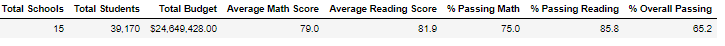
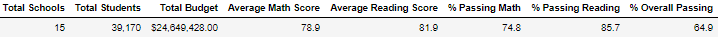

# School District Analysis

## Project Overview 
The purpose of this project is to provide accurate school district metrics after learning that the ninth grade reading and math scores of Thomas High School (THS) have been compromised. First, we were tasked to remove the bad data by replacing the THS ninth grade scores with NaNs. After completion, we then re-ran our analysis about the school district data to determine how removal of the bad THS 9th grade data have influenced our data set. 

## Results

We re-ran analysis of our school data after removing the THS ninth grade data and we are now going to share how the following points:
- How is the district summary affected?
- How is the school summary affected?
- How does replacing the ninth graders' math and reading scores affect THS's performance relative to the other schools?
- How does replacing the ninth-grade scores affect the following:
  - Math and reading scores by grade
  - Scores by school spending
  - Scores by school size
  - Scores by school type
  
### District Summary Changes

When comparing the District summaries before and after removal of the THS ninth grade data, there are slight changes to the district summaries but they are not that significant. Average Scores and % of Students Passing a particular subject had shifts of, at most 0.3%. Since district data represents a huge student population, 39170 students, removal of 461 records from THS ninth graders do little to move the needle significantly.

#### District Summary Uncleansed

#### District Summary Cleansed

### School Summary Change

The only significant changes within the School Summary table are only reflected about Thomas High School's data. We will go into that in the next sub section. 

### Changes to Thomas High School Performance Compared to Other Schools

When we removed the ninth grade scores from Thomas High School, we saw a significant improvement about the passing percentages for reading, math, and overall for Thomas High School. The Average Math and Reading scores remained unaffected by clearing out the ninth grade data which demonstrates that by removing the faulty ninth grade data Thomas High School's passing percentages significantly increased. Below are the movements in percentage passing:

- % Passing Math: 66.91% -> 93.19%
- % Passing Reading: 69.66% -> 97.02%
- % Passing Overall: 65.08% -> 90.63%

#### Thomas High School Summary Uncleansed

#### Thomas High School Summary Cleansed

The comparison is clearly demonstrated between the Uncleansed versus Cleansed Thomas High School images below. As a result of this change, when we sort the schools within this district based on "% Overall Passing", Thomas High School moves from being in the middle of the pack to number 2 overall in the district in "% Overall Passing"!

### Impacts of Replacing Ninth Grade Scores
The only impacts observed in replacing the ninth grade reading/math scores were reflected about the ninth grade entries for Thomas High School. Where there were previously data for ninth grade reading/math scores, they now read NaN. Scores based school size, spending and type were unaffected by the removal of the ninth grade Thomas High School data.

## Summary

By removing the faulty ninth grade Thomas High School reading/math scores, there's a significant increase in the percentage of students that are passing math/reading for Thomas High School. In turn, the "% Overall Passing" for THS also increased. Each mark observed an increase of at least 25% as a result of removing the bad student data. With that, when we look at top schools in the district based on "% Overall Passing", Thomas High School jumps in ranking from 7th to 2nd, ahead of Griffin High School.

